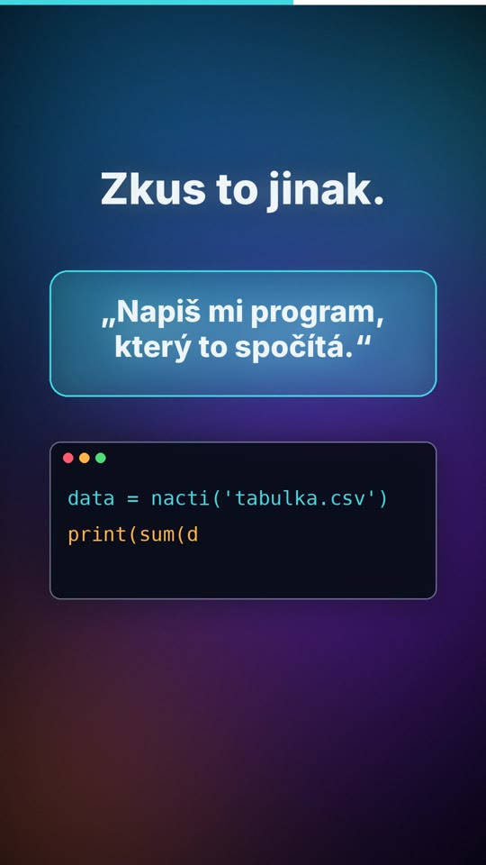
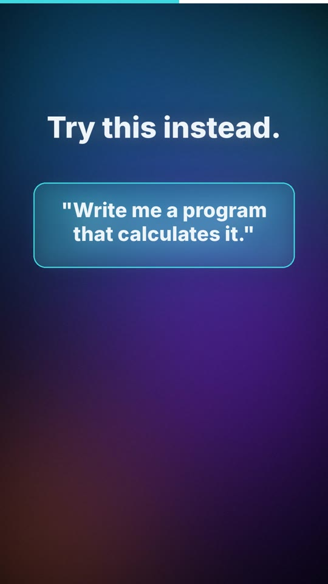
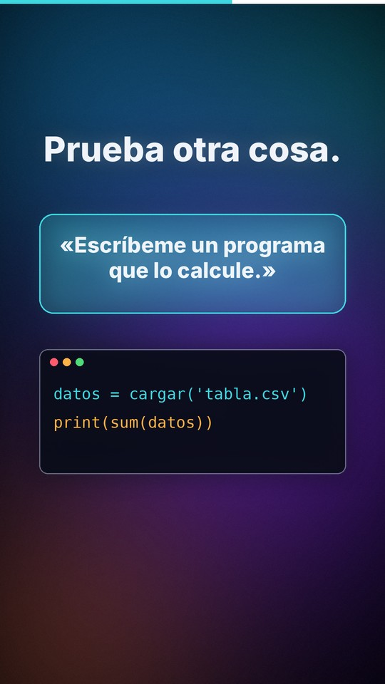

# 03 · Nech AI postavit kalkulačku / Have AI build the calculator / Que la IA te construya la calculadora

| | 🇨🇿 Česky | 🇬🇧 English | 🇪🇸 Español |
|---|---|---|---|
| Video | [03-nech-ai-postavit-kalkulacku-CZ.mp4](03-nech-ai-postavit-kalkulacku-CZ.mp4) (31 s) | [03-have-ai-build-the-calculator-EN.mp4](03-have-ai-build-the-calculator-EN.mp4) (35 s) | [03-que-la-ia-te-construya-la-calculadora-ES.mp4](03-que-la-ia-te-construya-la-calculadora-ES.mp4) (38 s) |
| Náhled |  |  |  |

**Myšlenka:** Jazykový model nepočítá jako kalkulačka, odhaduje, jak vypadá správná odpověď – u velké tabulky se snadno splete. Lepší je nechat ho napsat program: ten se jednou zkontroluje a pak počítá přesně, pokaždé stejně.

## Mluvený text

| Scéna | Česky | English | Español |
|---|---|---|---|
| 1 | Chceš, aby AI spočítala tvoje data? | Want AI to crunch your numbers? | ¿Quieres que la IA haga las cuentas con tus datos? |
| 2 | Má to háček. Jazykový model nepočítá jako kalkulačka. Odhaduje, jak vypadá správná odpověď. | There's a catch. A language model doesn't calculate like a calculator. It predicts what the right answer looks like. | Pero ojo. Un modelo de lenguaje no calcula como una calculadora. Predice cómo debería ser la respuesta correcta. |
| 3 | U velké tabulky se pak snadno splete. A na první pohled to nepoznáš. | With a big spreadsheet, it can easily slip. And at first glance, you won't notice. | Con una hoja de cálculo grande, puede equivocarse con facilidad. Y a primera vista no lo notas. |
| 4 | Zkus to jinak. Řekni mu: napiš mi program, který to spočítá. | Try this instead. Tell it: write me a program that calculates it. | Prueba otra cosa. Dile: escríbeme un programa que lo calcule. |
| 5 | Program si jednou zkontroluješ. Pak počítá přesně, pokaždé stejně. A zůstane ti. | You check the program once. Then it calculates exactly, the same way every time. And you get to keep it. | El programa lo revisas una vez. Después calcula con exactitud, siempre igual. Y lo conservas. |
| 6 | AI tedy nemá dělat kalkulačku. Má ti ji postavit. | So don't make AI be your calculator. Have it build you one. | Así que no le pidas a la IA que sea tu calculadora. Pídele que te construya una. |

## Soubory

`zvuk/` nahrávky z ElevenLabs (Kuba / George) · `zdroj/make.py` scény · `zdroj/build.py` sestavení · `zdroj/casovani.json` časování řeči

---

[← Naučná videa](../README.md)
